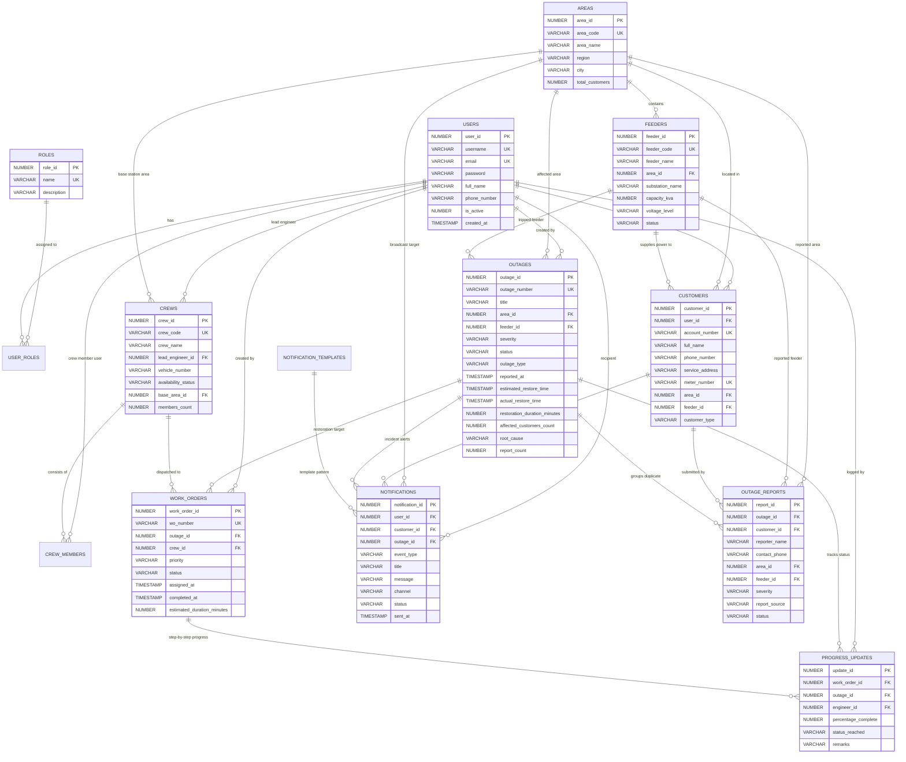

# Entity-Relationship Diagram (ERD)
## Outage Management and Restoration System (OMRS) - J16

```mermaid
erDiagram
    ROLES ||--o{ USER_ROLES : "assigned to"
    USERS ||--o{ USER_ROLES : "has"
    USERS ||--o{ CUSTOMERS : "registered as"
    USERS ||--o{ OUTAGES : "created by"
    USERS ||--o{ CREWS : "lead engineer"
    USERS ||--o{ CREW_MEMBERS : "crew member user"
    USERS ||--o{ WORK_ORDERS : "created by"
    USERS ||--o{ PROGRESS_UPDATES : "logged by"
    USERS ||--o{ NOTIFICATIONS : "recipient"

    AREAS ||--o{ FEEDERS : "contains"
    AREAS ||--o{ CUSTOMERS : "located in"
    AREAS ||--o{ OUTAGES : "affected area"
    AREAS ||--o{ OUTAGE_REPORTS : "reported area"
    AREAS ||--o{ CREWS : "base station area"
    AREAS ||--o{ NOTIFICATIONS : "broadcast target"

    FEEDERS ||--o{ CUSTOMERS : "supplies power to"
    FEEDERS ||--o{ OUTAGES : "tripped feeder"
    FEEDERS ||--o{ OUTAGE_REPORTS : "reported feeder"

    CUSTOMERS ||--o{ OUTAGE_REPORTS : "submitted by"
    CUSTOMERS ||--o{ NOTIFICATIONS : "customer recipient"

    OUTAGES ||--o{ OUTAGE_REPORTS : "groups duplicate"
    OUTAGES ||--o{ WORK_ORDERS : "restoration target"
    OUTAGES ||--o{ PROGRESS_UPDATES : "tracks status"
    OUTAGES ||--o{ NOTIFICATIONS : "incident alerts"

    CREWS ||--o{ CREW_MEMBERS : "consists of"
    CREWS ||--o{ WORK_ORDERS : "dispatched to"

    WORK_ORDERS ||--o{ PROGRESS_UPDATES : "step-by-step progress"

    NOTIFICATION_TEMPLATES ||--o{ NOTIFICATIONS : "template pattern"

    USERS {
        NUMBER user_id PK
        VARCHAR username UK
        VARCHAR email UK
        VARCHAR password
        VARCHAR full_name
        VARCHAR phone_number
        NUMBER is_active
        TIMESTAMP created_at
    }

    ROLES {
        NUMBER role_id PK
        VARCHAR name UK
        VARCHAR description
    }

    AREAS {
        NUMBER area_id PK
        VARCHAR area_code UK
        VARCHAR area_name
        VARCHAR region
        VARCHAR city
        NUMBER total_customers
    }

    FEEDERS {
        NUMBER feeder_id PK
        VARCHAR feeder_code UK
        VARCHAR feeder_name
        NUMBER area_id FK
        VARCHAR substation_name
        NUMBER capacity_kva
        VARCHAR voltage_level
        VARCHAR status
    }

    CUSTOMERS {
        NUMBER customer_id PK
        NUMBER user_id FK
        VARCHAR account_number UK
        VARCHAR full_name
        VARCHAR phone_number
        VARCHAR service_address
        VARCHAR meter_number UK
        NUMBER area_id FK
        NUMBER feeder_id FK
        VARCHAR customer_type
    }

    OUTAGES {
        NUMBER outage_id PK
        VARCHAR outage_number UK
        VARCHAR title
        NUMBER area_id FK
        NUMBER feeder_id FK
        VARCHAR severity
        VARCHAR status
        VARCHAR outage_type
        TIMESTAMP reported_at
        TIMESTAMP estimated_restore_time
        TIMESTAMP actual_restore_time
        NUMBER restoration_duration_minutes
        NUMBER affected_customers_count
        VARCHAR root_cause
        NUMBER report_count
    }

    OUTAGE_REPORTS {
        NUMBER report_id PK
        NUMBER outage_id FK
        NUMBER customer_id FK
        VARCHAR reporter_name
        VARCHAR contact_phone
        NUMBER area_id FK
        NUMBER feeder_id FK
        VARCHAR severity
        VARCHAR report_source
        VARCHAR status
    }

    CREWS {
        NUMBER crew_id PK
        VARCHAR crew_code UK
        VARCHAR crew_name
        NUMBER lead_engineer_id FK
        VARCHAR vehicle_number
        VARCHAR availability_status
        NUMBER base_area_id FK
        NUMBER members_count
    }

    WORK_ORDERS {
        NUMBER work_order_id PK
        VARCHAR wo_number UK
        NUMBER outage_id FK
        NUMBER crew_id FK
        VARCHAR priority
        VARCHAR status
        TIMESTAMP assigned_at
        TIMESTAMP completed_at
        NUMBER estimated_duration_minutes
    }

    PROGRESS_UPDATES {
        NUMBER update_id PK
        NUMBER work_order_id FK
        NUMBER outage_id FK
        NUMBER engineer_id FK
        NUMBER percentage_complete
        VARCHAR status_reached
        VARCHAR remarks
    }

    NOTIFICATIONS {
        NUMBER notification_id PK
        NUMBER user_id FK
        NUMBER customer_id FK
        NUMBER outage_id FK
        VARCHAR event_type
        VARCHAR title
        VARCHAR message
        VARCHAR channel
        VARCHAR status
        TIMESTAMP sent_at
    }
```
